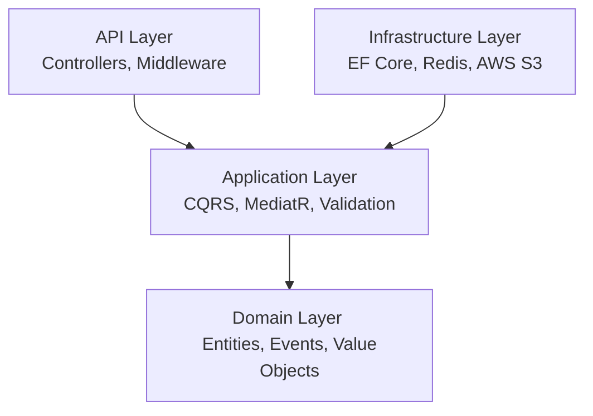
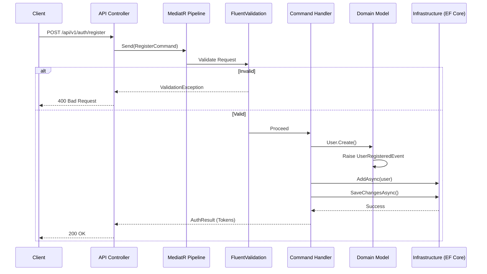

# Architecture & Design

SocialConnect follows **Clean Architecture** principles combined with **CQRS** (Command Query Responsibility Segregation) and **Domain-Driven Design (DDD)**. 

The architecture is implemented as a **Modular Monolith**. This means that although all code compiles into a single deployable application, it is logically partitioned into distinct features (Auth, Users, Posts, Messaging, Notifications). This minimizes the cost of extracting them into separate microservices later.

## 🏗️ Layered Clean Architecture

### 1. Domain Layer
The very center of the architecture. It contains no references to any other layer or external framework.
*   **Entities & Aggregate Roots**: Define business models (e.g., `User`, `Post`).
*   **Value Objects**: Immutable concepts (e.g., `Email`, `Password`).
*   **Domain Events**: Events that signify a change in state (e.g., `UserRegisteredEvent`).

### 2. Application Layer
Defines *what* the software is supposed to do.
*   **CQRS via MediatR**: Commands mutate state; Queries retrieve state.
*   **Validation Pipeline**: `FluentValidation` validates incoming requests before they hit the handler.
*   **Interfaces**: Defines contracts for external systems (e.g., `IUserRepository`, `ITokenService`) which the Infrastructure layer will implement.

### 3. Infrastructure Layer
Implements the interfaces defined by the Application layer.
*   **Persistence**: EF Core `DbContext`, Migrations, and SQL Server repositories.
*   **Services**: Implementations for JWT (`TokenService`), Emails (`SmtpEmailService`), and EventBus.
*   **Interceptors**: Automatically sets auditing fields (`CreatedBy`, `ModifiedAt`) or publishes Domain Events before saving to the database.

### 4. API Layer
The entry point. Receives HTTP requests, maps them to Application Commands/Queries, and returns formatted `ApiResponse<T>`.

---

## 🔄 Request Flow (CQRS pipeline)

When an HTTP request is made (e.g., Register User):

## 📡 Domain Events & Event Bus

When an aggregate state changes, we don't immediately trigger side-effects (like sending emails). Instead, we emit a **Domain Event**.

1.  `User.Create()` adds a `UserRegisteredEvent` to the entity's internal event list.
2.  When `SaveChangesAsync()` is called in the `ApplicationDbContext`, an EF Core interceptor grabs all pending domain events.
3.  The interceptor dispatches these events via MediatR.
4.  Event Handlers react to these events. For example, `SendWelcomeEmailHandler` listens to `UserRegisteredEvent`.
5.  If cross-service communication is needed (for the future microservices), the event is published to **RabbitMQ** via the `IEventBus`.

---

## ⏳ Background Processing (Hangfire)

To ensure high performance and responsiveness, time-consuming operations are offloaded to **Hangfire** for background execution:
*   **Email Dispatching**: Emails (like registration verification or password reset links) are queued and retried automatically.
*   **Media Processing**: Thumbnail generation for uploaded images and transcoding/optimizing media files.
*   **Scheduled Post Publishing**: Background scheduler checks for posts in the `Scheduled` status and publishes them once the scheduled time is reached.
*   **Orphan Cleanups**: Daily cleanups for expired tokens and orphaned image files in S3.

## 📡 Real-time Communication (SignalR)

Real-time capabilities are implemented using ASP.NET Core SignalR hubs:
*   **Chat Hub**: Manages SignalR connections for real-time one-to-one and group messaging, typing indicators, and message read statuses.
*   **Notification Hub**: Delivers instant alerts (e.g., likes, comments, mentions) to active users without requiring polling.

## 🛡️ EF Core Interceptors (Auditing)

Automatic data management and auditing are handled at the persistence layer:
*   **Auditable Entity Interceptor**: Automatically populates `CreatedAt` and `UpdatedAt` timestamps on any entity implementing `IHasTimestamps` during save operations.
*   **Audit Logging Interceptor**: Tracks all insert, update, and delete actions on monitored entities, automatically logging the old values, new values, and actor details into the `AuditLogs` table for security auditing.
